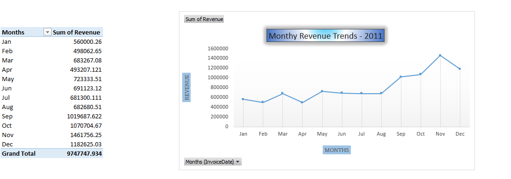
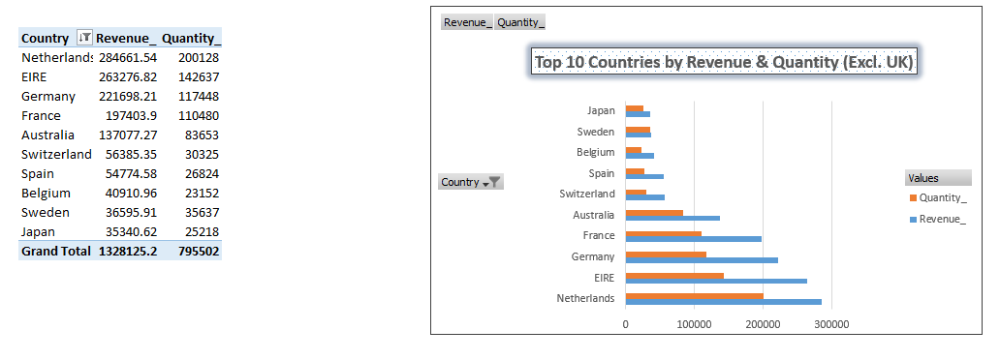
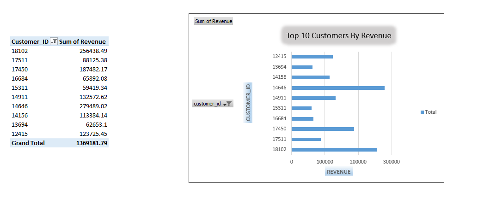
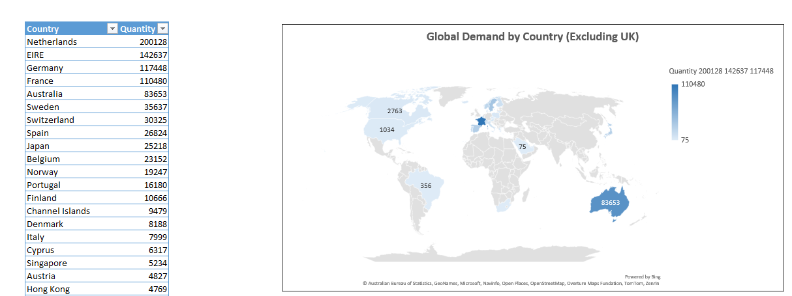
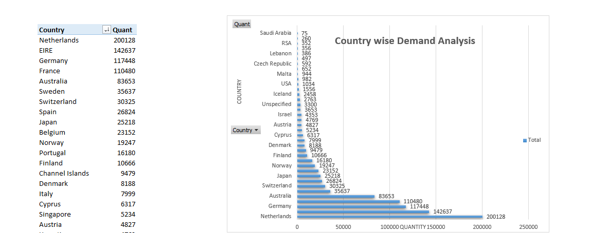

# ***Tata Data Analytics Virtual Internship Dashboard***

##### Project Overview

This project simulates the role of a Data Analytics Consultant at Tata Insights and Quants (Tata iQ). The objective is to analyze an online retail store's transaction data and build an executive-ready business intelligence dashboard (via Tableau/Power BI/Excel). This dashboard empowers senior executives specifically the CEO and CMO—to identify major revenue drivers, understand customer demographics, and strategically plan for next year's global expansion.

##### Key Features

•	**CEO Strategic Metrics:** Deep dive into monthly revenue trends, seasonality, and global market demands.
•	**CMO Marketing Insights:** Identification of top revenue-generating customers and high-value international markets.
•	**Data Cleansing Pipeline:** Structured validation checks to remove bad data records (negative quantities and sub-zero unit prices).
•	**Global Demand Map:** A geographic breakdown of sales to reveal untapped expansion opportunities outside the primary market.

##### Tools and Techniques

•	**Microsoft Excel**
•	**Data Quality Management & Cleaning** (Handling negative values and data anomalies)
•	**Data Interpretation & Business Storytelling**
•	**Executive Presentation Frameworks**

##### Dataset

The project utilizes an online retail transactional dataset covering:
•	Invoice details & timestamps
•	Customer IDs & demographic regions
•	Quantity sold & Unit prices
•	Country-wise global sales data (with a focus on non-UK expansion opportunities)

##### Dashboard Preview

##### Why This Dashboard Stands Out

•	**Expansion-Ready Analytics:** Dynamically filters out dominant local data (e.g., UK sales) to isolate and highlight true international growth potential.
•	**High Data Integrity:** Implements robust upstream logic checks to ensure accurate metric reporting free of transactional errors.

##### Author

F.Fousiya Fathima
